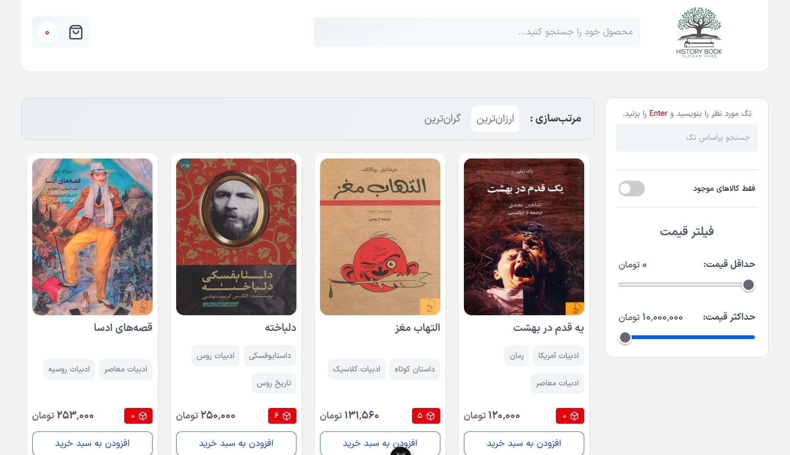

# 📖 HistoryBook

<h3>✨ Features</h3>

📦 Product Management – Load products from a JSON file and manage stock dynamically

🛍️ Shopping Cart – Add, remove, and track items with real-time updates

🔍 Search & Filters – Filter by tags, availability, and price range; search by product title

↕️ Sorting – Sort products by ascending or descending price

🔔 Toast Notifications – Interactive alerts using SweetAlert2

🎨 Responsive UI – Styled with Tailwind CSS for a modern and adaptive design

⚡ SPA with Vite – Fast development and optimized builds using Vite

<h3>🛠️ Tech Stack </h3>

Vue 3 – Frontend framework

Pinia – State management

Vite – Build tool & dev server

Tailwind CSS – Utility-first CSS framework

SweetAlert2 – Elegant toast and modal notifications

<h3> 🚀 Installation </h3>

Clone the repository
git clone https://github.com/alirezainfo/HistoryBook-Project.git

cd HISTORYBOOK

npm install

npm run dev

